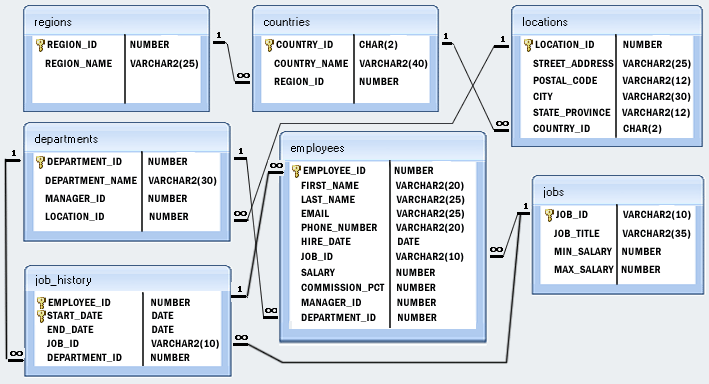

## Objectives of the week

This week you'll dive deeper in the ocean of SQL language. There will be more than one tasks related to the specific database schema what is provided by us.
The topics what you should be expertised:

* sub-selects
* GROUP BY statement
* aggregate functions
* sorting
* different join types
* views
* insert with select
* DISTINCT

---------------------------------

---------------------------------

## Init

In this task there is a given relational database model. You can find the relation model and the creational scripts below. (you can download the init script at the bottom of this page, named db.sql)

----------------

[01_hr_db_creation.sql](sample/01_hr_db_creation.sql)

----------------

[02_hr_db_table_creations_and_data_inserts.sql](sample/02_hr_db_table_creations_and_data_inserts.sql)

----------------------------------

----------------------------------

## [Basic Select](03_hr_db_basic_select.sql)

1. Write a query to get unique department ID from employee table.  
   Hint: Read more about DISTINCT
2. Write a query to get all employee details from the employee table order by first name, descending.  
   Hint: Read more about ORDER BY
3. Write a query to get the total salaries payable to employees.  
   Hint: Read more about SUM()
4. Write a query to get the maximum and minimum salary from employees table.  
   Hint: Read more about MIN() and MAX()
5. Write a query to get the average salary and number of employees in the employees table.  
   Hint: Read more about AVG()
6. Write a query to get the number of employees working with the company.  
   Hint: Read more about COUNT()
7. Write a query to get the number of jobs available in the employees table.
8. Write a query get all first name from employees table in upper case.  
   Hint: Read more about UPPER()
9. Write a query to get the first 3 characters of first name from employees table.  
   Hint: Read more about SUBSTRING()
10. Write a query to get the names (for example Ellen Abel, Sundar Ande etc.) of all the employees from employees table.  
    Hint: Read more about CONCAT()
11. Write a query to get first name from employees table after removing white spaces from both side.  
    Hint: Read more about TRIM()
12. Write a query to get the length of the employee names (first_name, last_name) from employees table.  
    Hint: Read more about LENGTH()
13. Write a query to select first 10 records from a table.  
    Hint: Read more about LIMIT

--------------------------

--------------------------

## [Restricting and Sorting Data](04_hr_db_restrict_and_sorting.sql)

1. Write a query to display the names (first_name, last_name) and salary for all employees whose salary is not in the range $10,000 through $15,000 and are in department 30 or 100.
2. Write a query to display the names (first_name, last_name) and hire date for all employees who were hired in 1987.  
   Hint: Read more about YEAR()
3. Write a query to display the first_name of all employees who have both "b" and "c" in their first name.
4. Write a query to display the last name, job, and salary for all employees whose job is that of a Programmer or a Shipping Clerk, and whose salary is not equal to $4,500, $10,000, or $15,000.
5. Write a query to select all record from employees where last name in 'BLAKE', 'SCOTT', 'KING' and 'FORD'.

--------------------------

--------------------------

## [Aggregate Functions and GROUP BY](05_hr_db_aggregate_functions.sql)

1. Write a query to get the number of employees with the same job.  
   Hint: Read more about GROUP BY
2. Write a query to find the manager ID and the salary of the lowest-paid employee for that manager.
3. Write a query to get the department ID and the total salary payable in each department.
4. Write a query to get the average salary for each job ID excluding programmer.
5. Write a query to get the job ID and maximum salary of the employees where maximum salary is greater than or equal to $4000.  
   Hint: Read more about HAVING
6. Write a query to get the average salary for all departments employing more than 10 employees.

--------------------------

--------------------------

## [Subqueries](06_hr_db_subqueries.sql)

1. Write a query to find the names (first_name, last_name) and salaries of the employees who have higher salary than the employee whose last_name='Bull'
2. Find the names (first_name, last_name) of all employees who works in the IT department.
3. Find the names (first_name, last_name) of the employees who are managers
4. Find the names (first_name, last_name), salary of the employees whose salary is greater than the average salary
5. Find the names (first_name, last_name), salary of the employees whose salary is equal to the minimum salary for their job grade
6. Find the names (first_name, last_name), salary of the employees who earn the same salary as the minimum salary for all departments.
7. Write a query to display the employee ID, first name, last names, and department names of all employees.  
   Hint: Result of a SELECT can be a selected field
8. Write a query to select last 10 records from a table.  
   Hint: Result of a SELECT can be a set where you can select

---------------------------

---------------------------

## [Joins](07_hr_db_joins.sql)

1. Write a query to find the addresses (location_id, street_address, city, state_province, country_name) of all the departments.  
   Hint: Read more about NATURAL JOIN
2. Write a query to find the names (first_name, last name), department ID and name of all the employees.
3. Find the names (first_name, last_name), job, department number, and department name of the employees who work in London.
4. Write a query to get the department name and number of employees in the department.
5. Find the names (first_name, last_name) and hire date of the employees who were hired after 'Jones'.

----------------------------

----------------------------

## [String Functions](08_hr_db_string_functions.sql)

1. Write a query to get the employee id, email id (discard the last three characters).  
   Hint: Read more about REVERSE() and SUBSTR()
2. Write a query to get the locations that have minimum street length.
3. Write a query that displays the first name and the length of the first name for all employees whose name starts with the letters 'A', 'J' or 'M'. Give each column an appropriate label. Sort the results by the employees' first names.

----------------------------

----------------------------

## How to prepare for week B

Create a small [demo](conclusion.md) for your work.  
Collect all the topics what you have learnt this week.  
Define some questions related to databases.  
Check the different katas on the http://cyber-dojo.org website.
